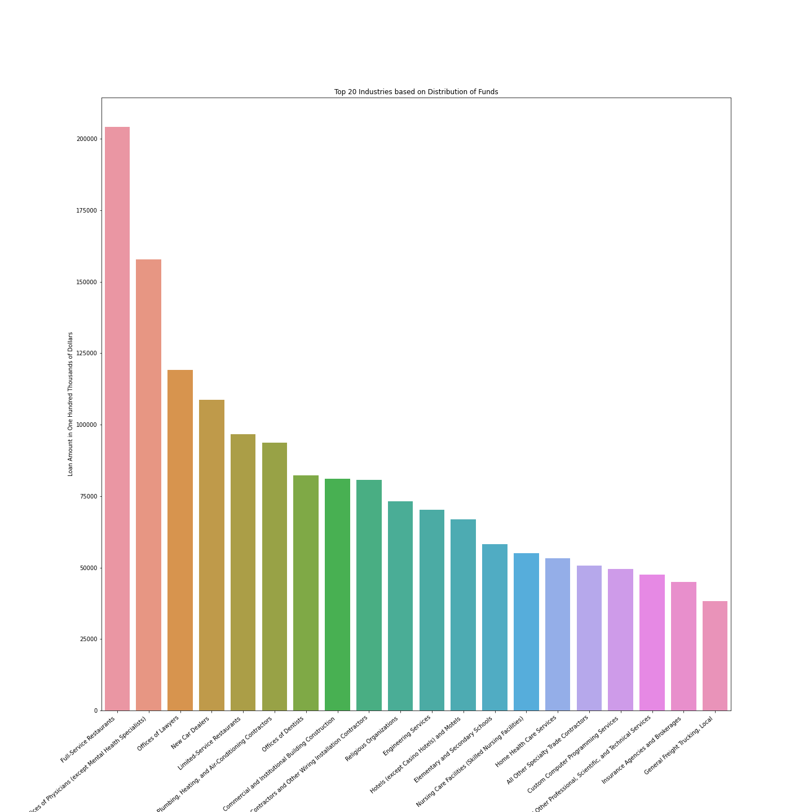

# PPP-Analysis

This project will take in the data regarding the PPP loans that were distributed between April and August of 2020 due to the COVID-19 outbreak 

#### Some housekeeping items 

[Link to data as of 08/08/2020](https://home.treasury.gov/policy-issues/cares-act/assistance-for-small-businesses/sba-paycheck-protection-program-loan-level-data)

[Link to data as of 12/01/2020](https://sba.app.box.com/s/5myd1nxutoq8wxecx2562baruz774si6)

Before going into inital findings, I wanted to note the differences between the two sets of data. The earlier data only containted the specific loan amounts for loans that were under $150k. Loans over that amount were put into 4 different categories but no specific amount was mentioned. There were other issues with the data as well but there was a succesful lawsuit and the SBA released the new data in the second link. It all seemed kinda sketchy to me. 
I have copied an article below. 

https://www.washingtonpost.com/business/2020/05/12/sba-foia-lawsuit/

Outlined below are some notable points about the data. 

116 of the Business names were not filled in
3,129 addresses were missing
132,940 did not have a code associated with the industry 
336,466 did not report how many jobs were associated with that business (596,090 also reported 0 while COUTLEE & SONS CONSTRUCTION in Hoonah Arkansas reported -6 Jobs. how?)

Now with that out of the way. Going into my initial analysis using the data from the second link 

## Main Points 

### BIG Numbers 

#### Number of Loans Made: 5,156,850
#### Total Amount of Money Distributed: 522,949,800,493.82

To put these values in perspective: In 2020, there were 31.7 million small businesses within the United States [sba](https://cdn.advocacy.sba.gov/wp-content/uploads/2020/06/04144224/2020-Small-Business-Economic-Profile-US.pdf) (so only 16.26% of small businesses recieved loans) and the total amount of Money Distributed is about 70.62% of the annual defense policy bill [WSJ](https://www.wsj.com/articles/trump-intensifies-threat-to-veto-defense-authorization-bill-11607442143)

#### Jobs 
As I noted before, the jobs numbers will not be accurate as there was a sizable amount of missing data. So assuming that all missing data would have been one job, we arrive at a conservative estimate of 51,717,759

### Industries 
Pretty self explanitory. Restraunts coming in first makes sense but Offices of Lawyers recieved the third largest amount of money? 

### Money Distribution 

### Demographics 
